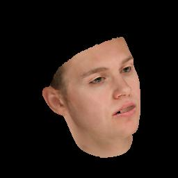

# face3d: Python tools for processing 3D face

#--------------------
# Issues and Solutions
#--------------------
1. ImportError: cannot import name 'mesh_core_cython' from 'face3d.mesh.cython' (unknown location)
    cd face3d/mesh/cython
    python3 setup.py build_ext --inplace
    python3 setup.py install

## Introduction

This project implements some basic functions related to 3D faces.

You can use this to process mesh data, generate 3D faces from morphable model, reconstruct 3D face with a single image and key points as inputs, render faces with difference lightings(for more, please see examples).

In the beginning, I wrote this project for learning 3D face reconstruction and for personal research use, so all the codes are written in python(numpy). However, some functions(eg. rasterization) can not use vectorization to optimize, writing them in python is too slow to use, then I choose to write these core parts in c++(without any other big libraries, such as opencv, eigen) and compile them with Cython for python use. 
So the final version is very lightweight and fast.

In addition, the numpy version is also retained, considering that beginners can focus on algorithms themselves in python and researches can modify and verify their ideas quickly. I also try my best to add references/formulas in each function, so that you can learn basic knowledge and understand the codes. 

For more information and researches related to 3D faces, please see [3D face papers](https://github.com/YadiraF/face3d/blob/master/3D%20Face%20Papers.md).

Enjoy it ^_^ 


## Structure

```python
# Since triangle mesh is the most popular representation of 3D face, 
# the main part is mesh processing.
mesh/             # written in python and c++
|  cython/               # c++ files, use cython to compile 
|  io.py                 # read & write obj
|  vis.py                # plot mesh
|  transform.py          # transform mesh & estimate matrix
|  light.py              # add light & estimate light(to do)
|  render.py             # obj to image using rasterization render

mesh_numpy/      # the same with mesh/, with each part written in numpy
                 # slow but easy to learn and modify

# 3DMM is one of the most popular methods to generate & reconstruct 3D face.
morphable_model/
|  morphable_model.py    # morphable model class: generate & fit
|  fit.py                # estimate shape&expression parameters. 3dmm fitting.
|  load.py               # load 3dmm data
```


## Examples:

`cd ./examples`

* **3dmm**.  `python 2_3dmm.py`

  left:     random example generated by 3dmm

  right:  fitting face with 3dmm using 68 key points

   

* **transform.**  `python 3_transform.py`  
  left:  

  fix camera position & use orthographic projection.  (often used in reconstruction)

  then transform face object: scale, change pitch angle, change yaw angle, change roll angle

  right: 

  fix obj position & use perspective projection(fovy=30).  (simulating real views)

  then move camera position and rotate camera: from far to near,  down & up, left & right, rotate camera

   

* **light**.   `python 4_light.py`  

  single point light: from left to right, from up to down, from near to far

  

* **image map** `python 6_image_map.py`  

  render different attributes in image pixels.

  : depth, pncc, uv coordinates

    

* **uv map** `python 7_uv_map.py`

  render different attributes in uv coordinates.

  : colors(texture map), position(2d facial image & corresponding position map)

  

     


## Getting Started

### Prerequisite

- Python 2 or Python 3 

- Python packages:
  * numpy 
  * skimage (for reading&writing image)
  * scipy (for loading mat)
  * matplotlib (for show)
  * Cython (for compiling c++ file)


### Usage

1. Clone the repository

    ```bash
    git clone https://github.com/YadiraF/face3d
    cd face3d
    ```

2. Compile c++ files to .so for python use (ignore if you use numpy version)

    ```bash
    cd face3d/mesh/cython
    python setup.py build_ext -i 
    ```

3. Prepare **BFM** Data (ignore if you don't use 3dmm)

   see [Data/BFM/readme.md](https://github.com/YadiraF/face3d/blob/master/examples/Data/BFM/readme.md)

4. Run examples

    (examples use cython version, you can change `mesh` into `mesh_numpy` to use numpy version)

    ```bash
    cd examples
    python 1_pipeline.py 
    ```

    For beginners who want to continue researches on 3D faces, I strongly recommend you first run examples according to the order, then view the codes in mesh_numpy and read the comments written in the beginning in each file. Hope this helps!  

    Moreover, I am new in computer graphics, so it would be great appreciated if you could point out some of my wrong expressions. Thanks!


## Changelog

* 2018/10/08 change structure. add comments. add introduction. add paper collections. 
* 2018/07/15 first release

